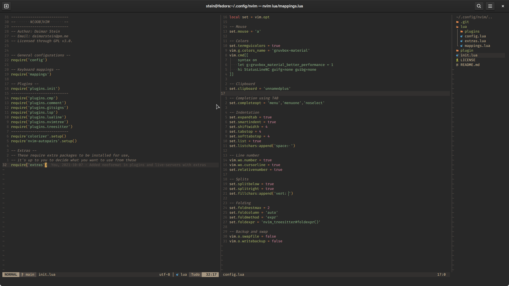

# N(oob)vim
A set of configurations for Neovim made in Lua by someone who doesn't know Lua but has a lot of free time.

## My objective
I like Neovim. A lot. I tried using VsCode for my really basic programming needs, but I was both a bit overwhelming and kind of dissappointing, specially when it comes to resource usage. So I went back to Neovim, and found out that almost none of the pre-configured configs out there really felt like home, and decided to create my own, using a mix of familiar keybindings for VsCode users and Vim users alike.

With no experience in Lua, a lot of procrastination time that should have gone to college work poured into it and a lot of trial and error, it's alive! So now I want to maintain it and make it public so people who actually know what they are doing can help make it better.

## Requirements
  - Neovim 0.5+
  - [Packer.nvim](https://github.com/wbthomason/packer.nvim) is the chosen packaging tool;
  - [A Nerd patched font](https://www.nerdfonts.com/) - I recommend FiraCode NF, which is the one I use

## Installation
  - First, install neovim, preferably through your package manager;
  - Install the patched font to get all the icons;
  - Then install packer.nvim, in order to manage your plugins:

`git clone --depth 1 https://github.com/wbthomason/packer.nvim\ ~/.local/share/nvim/site/pack/packer/start/packer.nvim`
  - Now, download and extract the package in the releases or (if you want the bleeding edge), clone the repo:

`git clone https://github.com/not-a-dev-stein/N-oob-vim ~/.config/nvim`
  - Now run `nvim +PackerSync` to install and update all the plugins
  - Install the language servers you need with :LspInstall
  - Install the [extras](https://github.com/not-a-dev-stein/N-oob-vim/#extra-plugins-outside-of-nvim) for whatever extra feature you want;
  - That's it!

### Colorscheme used:
  - [onedark](https://github.com/olimorris/onedark.nvim)

### Language servers pre-configured with:
  - [lspconfig](https://github.com/neovim/nvim-lspconfig) - for native LSP
  - [lspinstall](https://github.com/kabouzeid/nvim-lspinstall) - to easily install language servers
  - [cmp-nvim-lsp](https://github.com/hrsh7th/cmp-nvim-lsp) - for better integration with the native LSP
  - [cmp-buffer](https://github.com/hrsh7th/cmp-buffer) - for suggesting words used in the buffer in the completion
  - [cmp_luasnip](https://github.com/saadparwaiz1/cmp_luasnip) - for using luasnip as a source for nvim-cmp's completion
  - [LuaSnip](https://github.com/L3MON4D3/LuaSnip) - snippets support
  - [nvim-cmp](https://github.com/hrsh7th/nvim-cmp) - for TAB completion

### Plugins included and pre-configured are:
  - [autopairs](https://github.com/windwp/nvim-autopairs) - for automatic pairing of brackets, parenthesis, etc.
  - [barbar](https://github.com/romgrk/barbar.nvim) - A nice tab/buffer bar
  - [colorizer](https://github.com/norcalli/nvim-colorizer.lua) - for showing color on HEX codes (ex. #ffffff)
  - [comment](https://github.com/terrortylor/nvim-comment) - for easier line commenting (pre-configured with 'SPACE+//')
  - [dashboard](https://github.com/glepnir/dashboard-nvim) - Nice and clean dashboard for when you open nvim cleanly
  - [gitsigns](https://github.com/lewis6991/gitsigns.nvim) - for git signs for when and where you have diffs, and checking blame
  - [indent-blankline](https://github.com/lukas-reineke/indent-blankline.nvim) - for better indentation, showing visible signs for tabs and spaces
  - [lualine](https://github.com/hoob3rt/lualine.nvim) - a better statusline in both looks and functionality
  - [markdown-preview](https://github.com/iamcco/markdown-preview.nvim) - An easy way to preview how your markdown files will look like
  - [nvim-tree](https://github.com/kyazdani42/nvim-tree.lua) - an easy and fast file explorer to the side of the screen
  - [suda](https://github.com/lambdalisue/suda.vim) - for automatically running nvim with sudo when needed
  - [telescope](https://github.com/nvim-telescope/telescope.nvim) - really powerful searching tool
  - [treesitter](https://github.com/nvim-treesitter/nvim-treesitter) - for better syntax highlighting, indenting and folding (which you can use with `z+a`)
  - [ts-rainbow](https://github.com/p00f/nvim-ts-rainbow) - for color matching of brackets, parenthesis, etc.
  - [web-devicons](https://github.com/kyazdani42/nvim-web-devicons) - icons for other extensions, like nvim-tree and lualine 

### Extra plugins outside of nvim
  - [live-server](https://www.npmjs.com/package/live-server) - for people who do web development, no need to keep refreshing your page after every change

### Non-default keybindings
`space` is your leader key by default, **press it twice to quickly switch between the last two buffers**;

`< >` to change indentation levels multiple times on visual mode, instead of having to use `.` to repeat;

`shift+j` and `shift+k` to easily move an entire line up or down;

`ctrl+shift+i` to automatically format your code with Nformat;

`ctrl+hjkl` to navigate between splits in your screen (including nvim-tree);

`leader+t` to open a terminal in split;

`ctrl+a` *in terminal mode* to return to normal mode;

`ctrl+m` to toggle the preview of your Markdown files with markdown-preview;

### Custom commands
`:LiveServer` to start your live server

## Biggest references and help
Props to the [NvChad](https://github.com/NvChad/NvChad/) guys, I have used their config for a long while before using VsCode and used most of the extensions they use as a base for mine, removing what I don't use and adding what's more convenient for me. [LunarVim](https://github.com/LunarVim/LunarVim) also had a big part in it, specially due to [ChrisAtMachine's](https://www.youtube.com/channel/UCS97tchJDq17Qms3cux8wcA) videos and livestreams, it was probably the best help I got in porting my old config to Lua.

## What you can do to help
Everything. No joke. I have no experience in Lua, so I'm sure there's a lot that can be optimized and improved. If you want to check it out (and probably cringe a little) feel free to check the code, and use it for whatever you need. It's  all yours, my friend.
