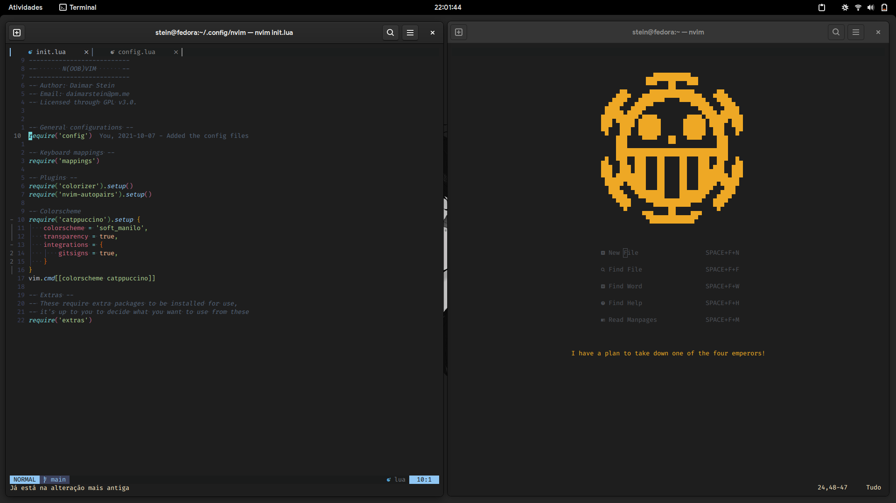

# N(oob)vim
A set of configurations for Neovim made in Lua by someone who doesn't know Lua but has a lot of free time.

## My objective
I like Neovim. A lot. I tried using VsCode for my really basic programming needs, but I was both a bit overwhelming and kind of dissappointing, specially when it comes to resource usage. So I went back to Neovim, and found out that almost none of the pre-configured configs out there really felt like home, and decided to create my own, using a mix of familiar keybindings for VsCode users and Vim users alike.

With no experience in Lua, a lot of procrastination time that should have gone to college work poured into it and a lot of trial and error, it's alive! So now I want to maintain it and make it public so people who actually know what they are doing can help make it better.

### Language servers pre-configured with:
  - [lspconfig](https://github.com/neovim/nvim-lspconfig) - for native LSP
  - [cmp-nvim-lsp](https://github.com/hrsh7th/cmp-nvim-lsp) - for better integration with the native LSP
  - [cmp-buffer](https://github.com/hrsh7th/cmp-buffer) - for suggesting words used in the buffer in the completion
  - [cmp_luasnip](https://github.com/saadparwaiz1/cmp_luasnip) - for using luasnip as a source for nvim-cmp's completion
  - [LuaSnip](https://github.com/L3MON4D3/LuaSnip) - snippets support
  - [nvim-cmp](https://github.com/hrsh7th/nvim-cmp) - for TAB completion

### Plugins included and pre-configured are:
  - [autopairs](https://github.com/windwp/nvim-autopairs) - for automatic pairing of brackets, parenthesis, etc.
  - [colorizer](https://github.com/norcalli/nvim-colorizer.lua) - for showing color on HEX codes (ex. #ffffff)
  - [comment](https://github.com/terrortylor/nvim-comment) - for easier line commenting (pre-configured with 'SPACE+/')
  - [gitsigns](https://github.com/lewis6991/gitsigns.nvim) - for git signs for when and where you have diffs, and checking blame
  - [indent-blankline](https://github.com/lukas-reineke/indent-blankline.nvim) - for better indentation, showing visible signs for tabs and spaces
  - [lualine](https://github.com/hoob3rt/lualine.nvim) - a better statusline in both looks and functionality
  - [neoformat](https://github.com/sbdchd/neoformat) - for automatic formatting
  - [nvim-tree](https://github.com/kyazdani42/nvim-tree.lua) - an easy and fast file explorer to the side of the screen
  - [suda](https://github.com/lambdalisue/suda.vim) - for automatically running nvim with sudo when needed
  - [treesitter](https://github.com/nvim-treesitter/nvim-treesitter) - for better syntax highlighting, indenting and folding (which you can use with 'za')
  - [ts-rainbow](https://github.com/p00f/nvim-ts-rainbow) - for color matching of brackets, parenthesis, etc.
  - [web-devicons](https://github.com/kyazdani42/nvim-web-devicons) - icons for other extensions, like nvim-tree and lualine 

### Extra plugins outside of nvim (still not 100% working, but you can try it)
  - [live-server](https://www.npmjs.com/package/live-server) - for people who do web development, no need to keep refreshing your page after every change

Check the lsp.lua file to configure it with the language servers that best fit your needs. In my case I have a bunch of them installed and set to dinamically launch depending on the filetype. If you want to install them manually you can see more about how to do it [here](https://github.com/neovim/nvim-lspconfig/blob/master/CONFIG.md).

I decided not to use [lspinstall](https://github.com/kabouzeid/nvim-lspinstall) for easier installing and management of language servers due to it being a bit heavier and since I could manage them myself with no worries, but if you need them I'd highly recommend installing it.

### Non-default keybindings
`space` is your leader key by default;

`< >` to change indentation levels multiple times on visual mode, instead of having to use `.` to repeat;

`shift+j` and `shift+k` to easily move an entire line up or down;

`ctrl+shift+i` to automatically format your code with Noformat;

`ctrl+HJKL` to navigate between splits in your screen (including nvim-tree)

### Custom commands
`:T` command to open a split terminal;

`:LiveServer` to start your live server (still not fully implemented correctly)

## Biggest references and help
Props to the [NvChad](https://github.com/NvChad/NvChad/) guys, I have used their config for a long while before using VsCode and used most of the extensions they use as a base for mine, removing what I don't use and adding what's more convenient for me. [LunarVim](https://github.com/LunarVim/LunarVim) also had a big part in it, specially due to [ChrisAtMachine's](https://www.youtube.com/channel/UCS97tchJDq17Qms3cux8wcA) videos and livestreams, it was probably the best help I got in porting my old config to Lua.

## What you can do to help
Everything. No joke. I have no experience in Lua, so I'm sure there's a lot that can be optimized and improved. If you want to check it out (and probably cringe a little) feel free to check the code, and use it for whatever you need. It's  all yours, my friend.
